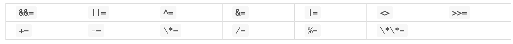
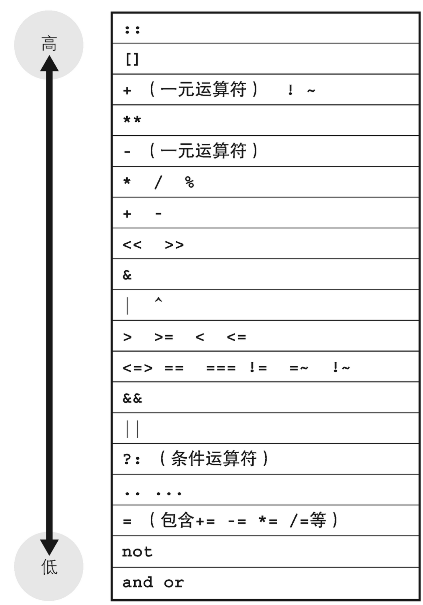
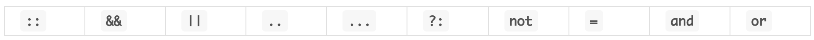

## 运算符

支持的运算符有如下

#### 一、赋值运算符



#### 二、逻辑运算符

* **表达式的执行顺序是从左到右**
* **如果逻辑表达式的真假已经可以确定，则不会再判断剩余的表达式**
* **最后一个表达式的值为整体逻辑表达式的值**

||、&&

#### 三、条件运算符

条件?表达式1:表达式2

#### 四、范围运算符

在 Ruby 中有表示数值范围的范围（range）对象

x``..``y：表示x到y的范围

x`...`y：表示x到y的前一个元素

```
p (5..10).to_a    #=> [5, 6, 7, 8, 9, 10]
p (5...10).to_a   #=> [5, 6, 7, 8, 9]
```

在 `Range` 对象内部，可以使用 `succ` 方法根据起点值逐个生成接下来的值。具体来说就是，对 `succ` 方法的返回值调用 `succ` 方法，然后对该返回值再调用 `succ` 方法……直到得到的值比终点值大时才结束处理

```ruby
val = "a"
val = val.succ # => b
```

#### 五、运算符优先级



#### 六、定义运算符

分为：

* 不能重定义的运算符



* 支持重定义的运算符

二元运算符

定义四则运算符等二元运算符时，会将运算符名作为方法名，按照定义方法的做法重定义运算符。运算符的左侧为接收者，右侧被作为方法的参数传递。在代码清单 9.1 的程序中，我们将为表示二元坐标的 `Point` 类定义运算符 `+` 以及 `-`。