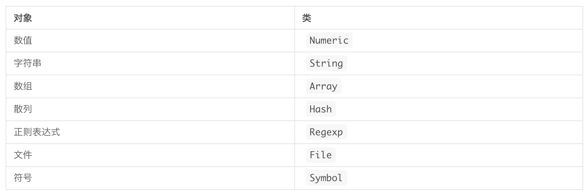

### 对象和类

-------

### 一、对象

#### 1.1 对象类型

数值、字符串、数组、散列、正则表达式、时间、文本、符号等都被称为对象

像数组、散列这样保存对象的对象，在**ruby**中称为容器(container)

#### 2.1 数组（Array）

> 是一个按顺序保存多个对象的对象，是基本容器之一，一般称为数组对象或者Array对象

##### 创建

```ruby
names = ["A", "B", "C", "D"]
// 表示空数组
names = []
```

##### 抽取数组元素(对象)

* 数组中的每一个对象都有一个表示其位置的编号，称为索引(index)

```ruby
# 把names数组中的第一个元素取出
names[0]
```

* 将对象保存在数组中

```ruby
names[0] = "李四"
```

注意点：

* 数组的索引值是从0开始

* 如果指定了数组中不存在的索引值，数组的大小会随之变化，Ruby数组的大小是按实际情况自动调整(即动态调整)

```ruby
names = ["A", "B", "C", "D"]
names[6] = "M"
=> ["A", "B", "C", "D", nil, nil, "M"]
```

##### 数组的元素

* 任何对象都可以作为数组元素保存到数组中
* 还支持多种不同对象的混合保存

```ruby
mixed = [1, "李四", 2, "王五", 3]
```

##### 获取数组的大小

* 使用size方法来获取数组大小

```ruby
names.size
```

##### 遍历数组元素

* 使用each方法

```ruby
数组.each do | 变量|
  每次循环的处理
end
```

#### 2.2 散列(hash)

> 是一个程序中常用到的容器，散列是键值对(key-valu pair)的一种数据结构。
>
> 通常在**ruby**中是以字符串或者符号(symbol)作为键，来保存对应的对象

##### 2.2.1 符号

符号也是对象，与字符串对象类似，一般作为名称标签来使用，用于表示方法等的对象的名称

* 创建符号

  只需在标识符的开头加上**:**

```ruby
// 表示:foo是符号
sym = :foo
等价于下面方式
sym2 = :"foo"
```

* 符号能实现的功能大部分字符串也能实现，但是像散列键这样只是单纯判断“是否相等”的处理中，使用符号会比字符串比较更加有效率

* 符号与字符串可以任意转换

```ruby
sym = :foo
// 符号 => 字符串
sym.to_s
// 字符串 => 符号
"foo".to_sym
```

##### 2.2.1 创建散列

创建时，使用**{}**,将创建的内容括起来，使用**=>**来定义获取对象时所需的**key**,以及对应的对象(value)

```ruby
address = {}:name => "小明", :pinyin => "战三", :postal => "李四"}
```

如果将符号作为键来使用，上面等价为下面

```ruby
address = {name: "小明", pinyin: "战三", postal: "李四"}
```

散列的使用

```ruby
// 获取键对应的value
散列名[:键名]
// 遍历散列每个值
散列.each do |键变量，值变量|
  每一次循环的处理
end
```

##### 2.3 正则表达式

> 判断字符串是否适用于某模式的过程称 为匹配，如果字符串适用于该模式则称为匹配成功

* 创建正则表达式对象的语法

```ruby
/模式/
# 例如 希望匹配 Ruby 字符串的正则表达式为：
/Ruby/
```

* 使用**=~**来匹配正则表达式和字符串

匹配正则表达式与字符串的写法如下：，默认区分大小写

```ruby
1、/模式/=~希望匹配的字符串
index = /Ruby/ =~ "123Ruby"
print index(值为3) 
2、在正则表达式右边的/后面添加i参数，表示不区分大小写匹配
```

如匹配成功，则返回匹配成功的位置索引，否则匹配失败

* 在正则表达式右面的/后面添加**i**则表示不区分大小写匹配

```ruby
/Ruby/=~ "ruby"
=> nil
/Ruby/=~ "RUBY"
=> nil
/Ruby/i=~ "ruby"
```

注意点：

* nil：是一个特殊的值，表示对象不存在，像在正则表达式中表示无法匹配成功一样，方法不能返回有意义的值时会返回**nil**,从数组或者散列里面获取对象时，如果指定不存在的索引或者键，则得到的返回值也是**nil**
* 在条件语种判断中，如果是flase或者nil，则都会认为是"假",除此之外都认为是"真"

### 二、类

---

类与对象的关系如下表



