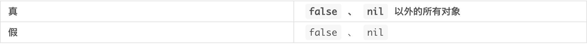

### 条件判断

---

#####  一、条件判断语句有

1、if 语句

2、unless 语句

3、case语句

Ruby的真假值如下表



此外，在Ruby中，还有个约定俗成的规则，为了使程序更容易理解，返回真假值的方法都要以 `?` 结尾

#####  二、逻辑运算符

1、&&

2、||

3、!取反

##### 三、if 语句

* then可以省略

```ruby
if 条件 then
  处理
end
```

```ruby
if 条件1 then
  处理1
elsif 条件2 then
  处理2
elsif 条件3 then
  处理3
else
  处理4
end
```

##### 四、unless 语句

与if语句相反,也是可以省略then

```ruby
unless 条件 then
  处理
end
```

```ruby
unless 条件
    处理1
else
    处理2
end
```

##### 五、case 语句

* 可以省略then

```ruby
case 比较对象
when 值1 then
    处理1
when 值2 then
    处理2
when 值3 then
    处理3
else 
    处理4
end
```

* when可以一次指定多个值

```ruby
tags = ["A", "IMG", "PRE"]
tags.each do |tagName|
    case tagName
    when "P", "A", "I", "B", "BLOCKQUOTE"
        puts "#{tagName} has child."
    when "IMG", "BR"
        puts "#{tagName} has no child."
    else
        puts "#{tagName} cannot be used."
    end
end
```

* ===

> 在 `case` 语句中，`when` 判断值是否相等时，实际是使用 `===` 运算符来判断的。左边是数值或者字符串时，`===` 与`==` 的意义是一样的，除此以外，`===` 还可以与`=~` 一样用来判断正则表达式是否匹配，或者判断右边的对象是否属于左边的类，等等。对比单纯的判断两边的值是否相等，`===` 能表达更加广义的“相等”。

```ruby
p (/zz/ === "xyzzy")    #=> true
p (String === "xyzzy")  #=> true
p ((1..3) === 2)        #=> true
```

> 用 `if` 语句改写 `case` 语句的程序如下所示。请注意 `when` 指定的对象在`===`h 的左边。
