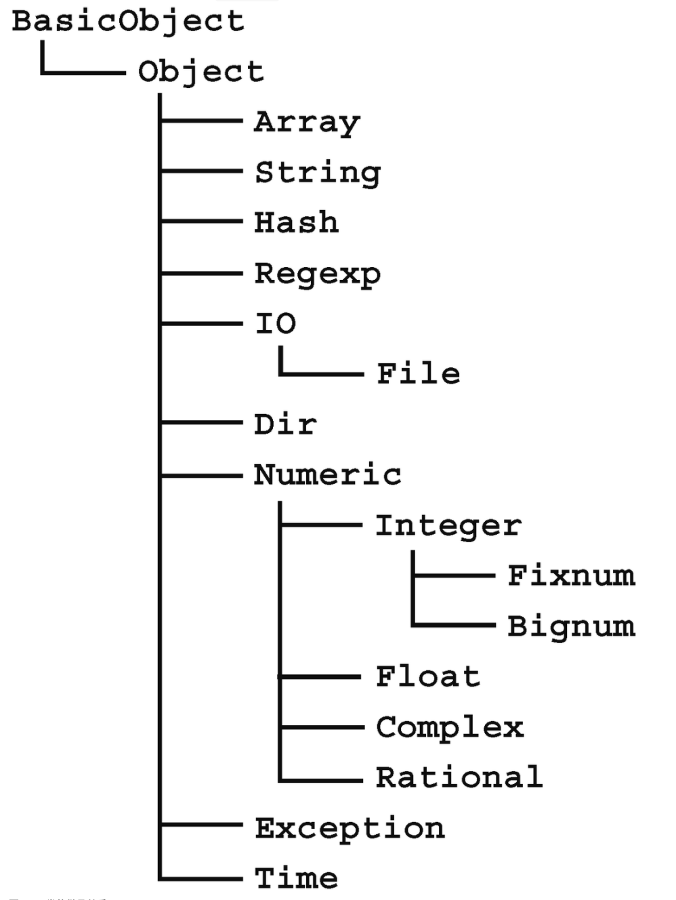
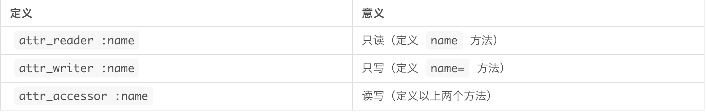

## 类和模块

| 类是面向对象中的一个重要术语

一、类

1、使用**class**来获取某个对象属于哪一个类

```ruby
ary = []
str = "Hello, World"
```

2、使用**instance_of?**判断某个对象是否属于某个类

```ruby
ary = []
str = "Hello world."
p ary.instance_of?(Array)
p str.instance_of?(String)
p ary.instance_of?(String)
p str.instance_of?(Array)
```

3、继承

| 把通过扩展已定义的类来创建新类称为继承

4、Ruby 类的继承关系图

**BasicObject**是所有Ruby类中所有类的父类，甚至连一般对象需要的功能都没有定义。因此普通对象所需要的类一般都被定义为 `Object` 类。字符串、数组等都是 `Object` 类的子类。



5、创建

* 最基础的方式

`class` 类名(名称首字母必须大写)

​	类的定义

`end`

```ruby
class HelloWorld
  def initilize(mynam ="Ruby")
    @name = myname
  end
  def hello
    puts "Hello, word. I am"
  end
end

bob = HelloWorld.new("Bob")
alice = HelloWorld.new("Alice")
ruby = HelloWorld.new
```

二、实例方法

1、`initilize`(**特殊的实例方法**)

在`class`中定义的方法为该类的实例方法，使用`new`方法生成新的对象时，`initialize`方法会被调用，同时`new`方法的参数和会被传递给`initialize`方法

```ruby
def initialize(myname = "Ruby") # Ruby 表示默认值
  @name = myname
end
```

@name：把以`@`开头的变量称为实例变量

引用未初始化的实例变量时返回值为`nil`

2、定义实例方法

```ruby
class HelloWorld
  def hello
    puts "Hello,world I am #{@name}"
end
```

三、存取器

* 在`Ruby`中，从对象外部不能直接访问实例变量或者对实例变量赋值，需要通过方法来访问对象的内部

```ruby
class HelloWorld
  def name          # 获取@name
    @name
  end

  def name=(value)  # 修改@name
    @name = value
  end
end
```

* 自动存取器

当对象的实例变量有多个时，如果逐个定义存取器，就会使程序变得难懂，而且也容易写错，所以Ruby提供了更简便的定义方法 `attr_reader`、`attr_writer`、`attr_accessor`



上面的效果等价于

```ruby
class HelloWord
  attr_accessor :name
end
```

* 在实例方法中使用**self**这个特殊变量来引用方法的接收者，调用方法时，如果省略了接收者，Ruby 就会默认把 `self` 作为该方法的接收者。因此，即使省略了 `self`，也还是可以调用 `name` 方法

```ruby
def greet
  print "Hi, I am #{name}"
end
```

* 当实例方法中已经有了 `name = "Ruby"` 这样的定义，但如果仅在方法内部定义名为 `name` 的局部变量，也不能以缺省接收者的方式调用 `name=` 方法。这种情况下，我们需要用 `self.name = "Ruby"` 的形式来显式调用 `name` 方法。

```ruby
def test_name
  name = "Ruby"         # 为局部变量赋值
  self.name = "Ruby"    # 调用name= 方法
end
```

四、类方法

方法的接收者就是类本身（类对象）的方法称为类方法。类方法的操作对象是类本身，定义如下:

第一种

```ruby
class HelloWorld
  ....
end
class << HelloWorld
  def hello(name)
    puts "#{name}"
  end
end
```

第二种

```ruby
class HelloWorld
  def self.cn_name
        '人'
    end
end
```

第三种

```ruby
class Helloworld
  class << self
    def hello(name)
      puts "#{name} said hello"
    end
end
```

第四种

```ruby
class HelloWorld.hello(name)
  puts "#{name} said hello"
end
```

将`class << 类名 ~ end` 这种写法的类定义称为单例类定义，单例类定义中定义的方法称为单例方法

五、常量

在class 上下文中定义常量

```ruby
class A1
  Version = "1.0"
end
// 使用
A1::Version=> 1.0
```

六、类变量

将@@开头的变量称为类变量

1、·常量不可以被修改，而类变量可以被修改

2、从类的外部访问类变量时也需要存取器，**注意**,之间修饰实例变量的关键字**attr_accessor**则不能使用，需要直接定义

```ruby
class HelloCount
    @@count = 0
    def HelloCount.count
        @@count
    end
    def initialize(myname="Ruby")
        @name = myname
    end
    def hello
        @@count += 1
        puts "Hello,world, I am #{@name}.\n"
    end
end

bob = HelloCount.new("Bob")
alice = HelloCount.new("Alice")
ruby = HelloCount.new

p HelloCount.count
bob.hello
alice.hello
ruby.hello
p HelloCount.count
```

七、方法访问修饰符

* public

公开修饰的方法，供外部调用(**默认**)

* private

在指定接收者的情况下不能调用该方法（只能使用缺省接收者的方式调用该方法，因此无法从实例的外部访问）**通常，initialize被定义为此修饰符**

* protected

在同一个类中时可将该方法作为实例方法调用

```ruby
class AccTest
    def pub
        puts "pub is a public method."
    end
    public :pub # 修饰pub方法为public
    def priv
        puts "priv is a private method."
    end
    private :pri # 把pri方法设定为private
end

acc = AccTest.new
acc.pub
acc.priv # 调用失败(in `private': undefined method `pri' for class `AccTest' (NameError))
```

效果与上面等同

```ruby
class AccTest
    public
        def pub
            puts "pub is a public method."
        end
				#此处可以定义更多方法
    private
        def priv
            puts "priv is a private method."
        end
  			#此处可以定义更多方法
end
```

```ruby
class Point
    attr_accessor :x, :y
    protected :x=, :y=

    def initialize(x=0, y=0)
        @x, @y = x, y
    end
end

p0 = Point.new
p0.x = 10.0 => error,无法访问到
```

八、扩展类

1、扩展类的方法

```ruby
class String
  # 为已有的类String，扩展count_word方法
    def count_word
        ary = self.split(/\s+/)
        return ary.size
    end
end
```

2、继承

定义格式

```ruby
class 类名 < 父类名
  ...定义
end
```

在父类中，通过使用**super**关键字来访问父类对应属性或者方法，**Ruby**中**不父类的多重继承**

**注意**

* 定义类时没有指定父类的情况下，默认该类为**Object**类的子类(`Object` 类提供了许多便于实际编程的方法。但在某些情况下，我们也有可能会希望使用更轻量级的类，而这时就可以使用 `BasicObject` 类，`BasicObject` 类只提供了组成 Ruby 对象所需的最低限度的方法。类对象调用 `instance_methods` 方法后，就会以符号的形式返回该类的实例方法列表)

4、**alias、undef**

`alias`：用于设置已存在方法的别名

```ruby
alias 别名 原名
```

除了设置别名，还可以在重定义已经存在的方法时，为了能用别名调用原来的方法，也需要使用`alias`

```ruby
class C1
    def hello
        "Hello"
    end
end
class C2 < C1
    alias old_hello hello
    def hello 
        "#{old_hello} , again"
    end
end
```

`undef`：用于删除已有方法的定义。与 `alias` 一样，参数可以指定方法名或者符号名

```ruby
undef 方法名 	#使用方法名
undef: 方法名  #使用符号名
```

```ruby
class C1
    def hello
        "Hello"
    end
    undef hello
end

obj = C1.new
p obj.hello
#执行结果 undefined method `hello' for #<C1:0x00007fd7ba081670> (NoMethodError)
```

5、模块

* 模块不能拥有实例
* 模块不能被继承

作用

* 提供命名空间(namespace)：对方法、常量、类等名称进行区分及管理的单位
* 利用**Mix-in**扩展功能：将模块混合到类中，在定义类时使用 `include`，模块里的方法、常量就都能被类使用

创建

使用`module` 关键字来创建模块，语法与创建类时几乎相同。模块名的首字母必须大写

```ruby
module 模块名
　模块定义
end
```

```ruby
module HelloModule          # module 关键字
  Version = "1.0"           # 定义常量

  def hello(name)           # 定义方法
    puts "Hello, #{name}."
  end

  module_function :hello    # 指定hello 方法为模块函数
end
# 使用
p HelloModule::Version      #=> "1.0"
HelloModule.hello("Alice")  #=> Hello, Alice.

include HelloModule         # 包含模块
p Version                   #=> "1.0"
hello("Alice")              #=> Hello, Alice.
```

定义模块中的方法

* 如果仅仅定义了方法，虽然在模块内部与包含此模块的上文中都可以直接调用，但却不能以“模块名 . 方法名”的形式调用。使用`module_function` 方法名|符号名，则会作为模块函数共公开给外部使用

```ruby
def hello(name)
  puts "Hello, #{name}."
end

module_function :hello
```

使用

* 通过 `include` 可以把模块内的方法名、常量名合并到当前的命名空间
* **模块名.方法名**的形式来调用在模块中定义的方法，并将定义的方法称为模块函数
* 如果没有定义与模块内的方法、常量等同名的名称，那么引用时就可以省略模块名

```ruby
include Math
p PI
# 等价于
p Math::PI
```

```ruby
#Mix-in
module MyModule
  # 共通的方法等
end

class MyClass1
  include MyModule
  # MyClass1 中独有的方法
end

class MyClass2
  include MyModule
  # MyClass2 中独有的方法
end
```
