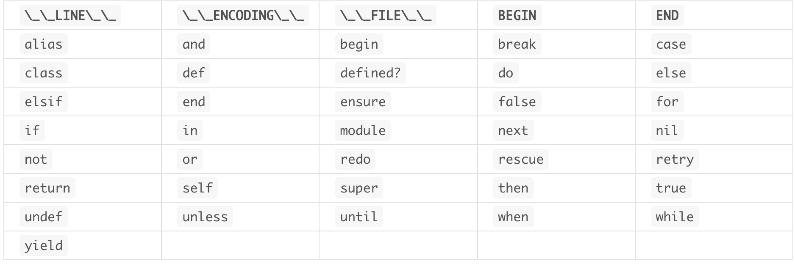

### 变量

---

#### 一、变量分类

在**Ruby**中存在如下4种类型的变量

##### 1、局部变量(local variable)|本地变量

* 以英文字母或者_开头
* 作用域：在程序的某个地方声明的变量名，再作用域外可以重复使用该变量名称

##### 2、全局变量(global variable)

* 以$开头
* 作用域：只要全局变量的名称相同，不管变量在程序的哪一个部分使用，程序都认为是同一个变量
* 通常不建议使用

##### 3、实例变量

* 是@开头

##### 4、类变量

* 以@@开头

##### 5、伪变量

* 是一种特殊的变量，由Ruby预先定义好的代表特定值的特殊变量，在程序中无法改变伪变量的值
* 主要有：nil、true、false、self 等等

##### 6、预定义变量

##### 7、常量

* 以大写英文字母开头
* 对于已经赋值的常量再赋值，Ruby会做出警告

```ruby
TEST = 1
puts TEST

执行结果=>
warning: already initialized constant TEST
warning: previous definition of TEST was here
1
```

##### 8、保留字

具体保留字如下表所示



#### 二、变量操作

2.1 多重赋值

* 只使用一个表达式来给多个变量赋值的简便方法

```ruby
a = 1
b = 2
c = 3
# 多重赋值
a, b, c = 1, 2, 3
```

* 如果=左侧数量多余右侧，则默认多余的变量被赋值为nil
* 如果=右侧数量多余左侧，则默认多余的赋值被忽略
* 如果在变量前加上`*`，表示 Ruby 会将未分配的值封装为数组赋值给该变量

* 可以基于此获取数组中的元素

```ruby
ary = [1, 2]
a, b = ary
puts a, b 结果如下：
a是1， b是2

# 获取数组首元素
a, = ary
a是1
```

* 获取嵌套数组的元素

```ruby
ary = [1, [2, 3], 4]
a, b, c = ary
p a => 1
p b = > [2, 3]
p c => 4

# 将左边的变量括起来，就可以进一步将内部数组的元素提取出来并赋值给对应变量
ary = [1, [2, 3], 4]
a, (b1, b2), c = ary
p b1 => 2
p b2 => 3
```

#### 三、变量命名规则

* 以变量名开头来决定变量的种类，这是 Ruby 中对变量命名时唯一要坚决遵守的规则
* 不要过多使用省略的名称
* 对于多个单词组合的变量名，使用 _ 隔开各个单词，或者单词以大写字母开头，即变量名要么叫做 `sort_list_by_name`，要么叫做 `sortListByName`。
* 一般来讲，Ruby 中的变量名和方法名使用前者，类名和模块名的使用后者。
