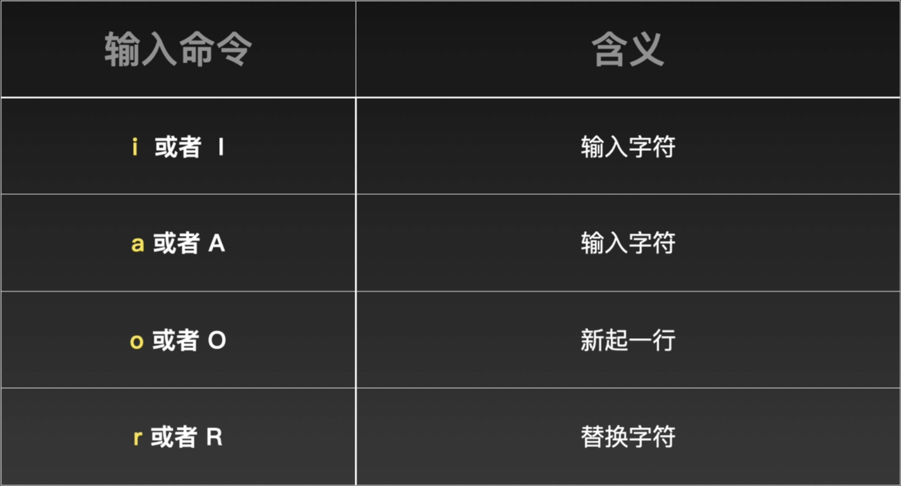
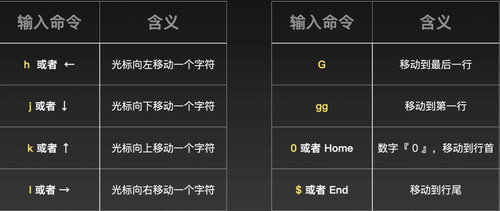
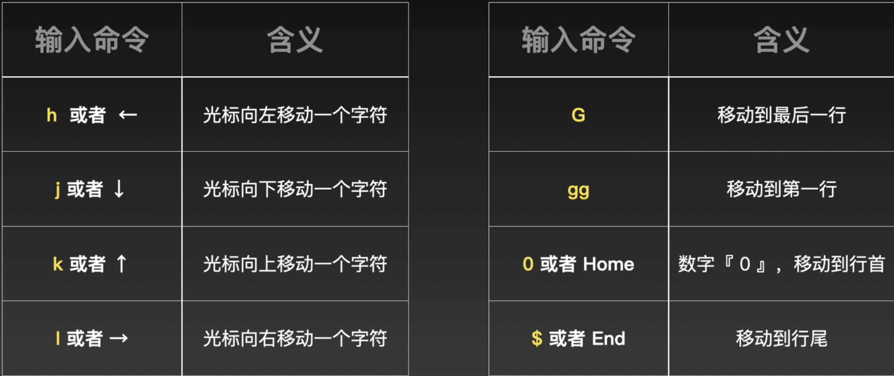
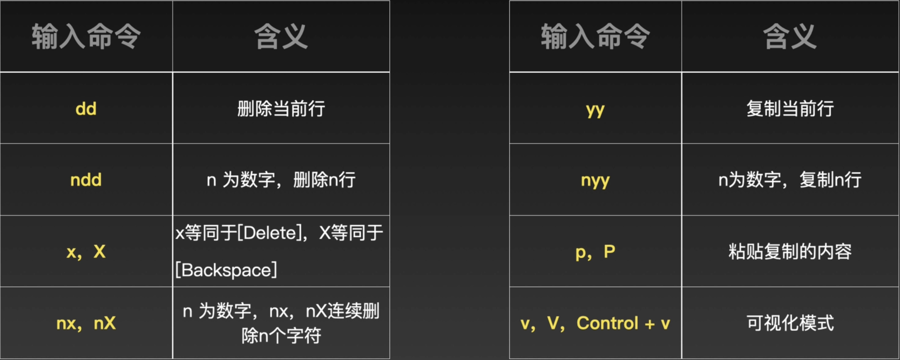
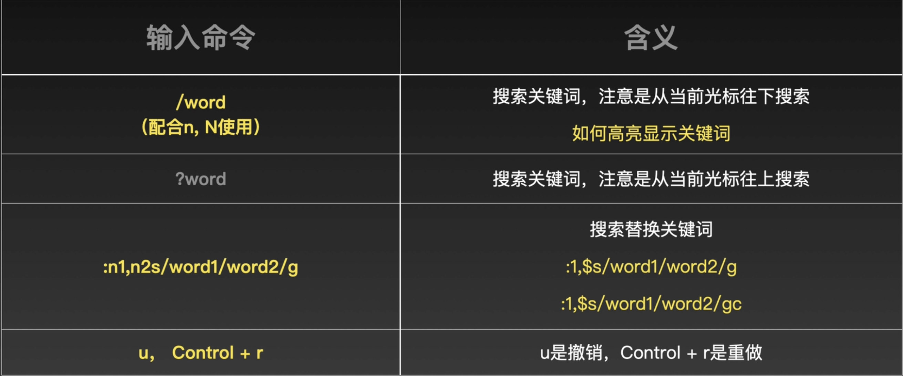
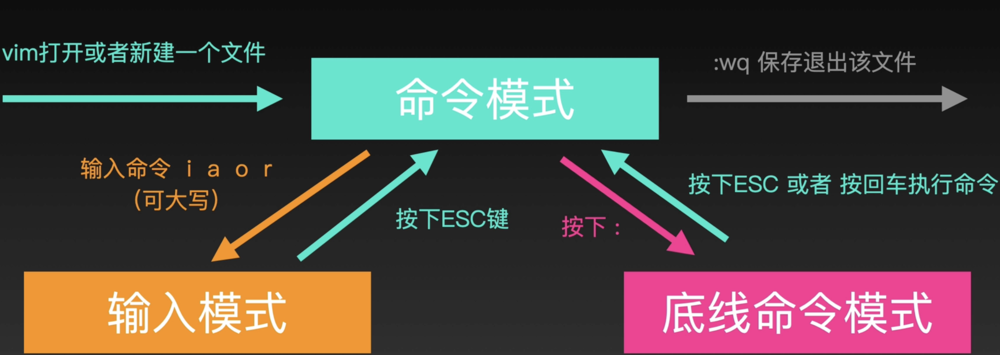

## Vim

支持三种模式

#### 命令模式

> 输入的内容当做命令看待

移动光标

文本操作

#### 输入模式

> 输入的内容当文本内容看待

#### 底线命令模式

> 输入的内容当命令看待，在底部显示

* :w 保存文件
* :w! 强制保存
* :q 退出文件
* :q! 强制退出，不保存
* :wq 保存退出文件
* :w filename 另存为其他文件
* :set nu 显示行号
* :set nonu 取消显示行号

#### 参考资料

* [视频](https://space.bilibili.com/522319853/channel/seriesdetail?sid=666503&ctype=0)
* [命令网站](https://ss64.com/osx/setfile.html)
* [命令全称](https://cloud.tencent.com/developer/article/1608604?from=15425&areaSource=102001.2&traceId=2VaO9mk2Fwz4dW-lxXCCd)

