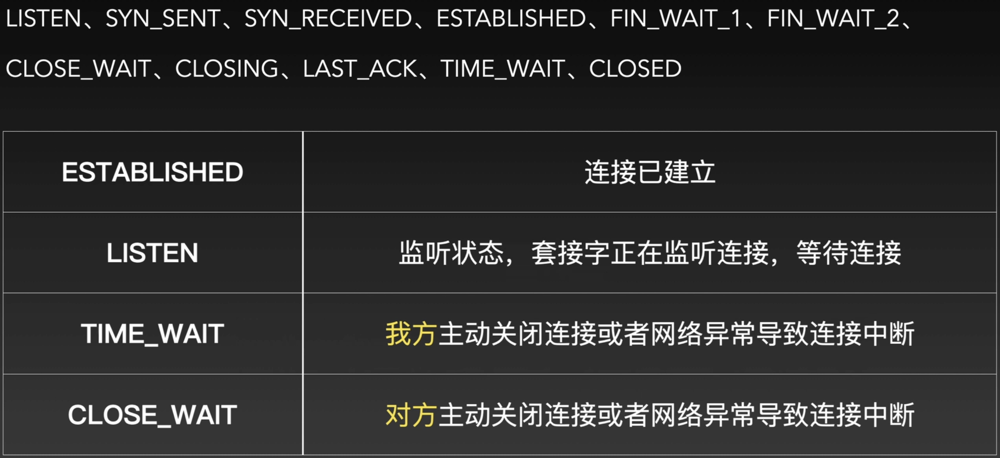
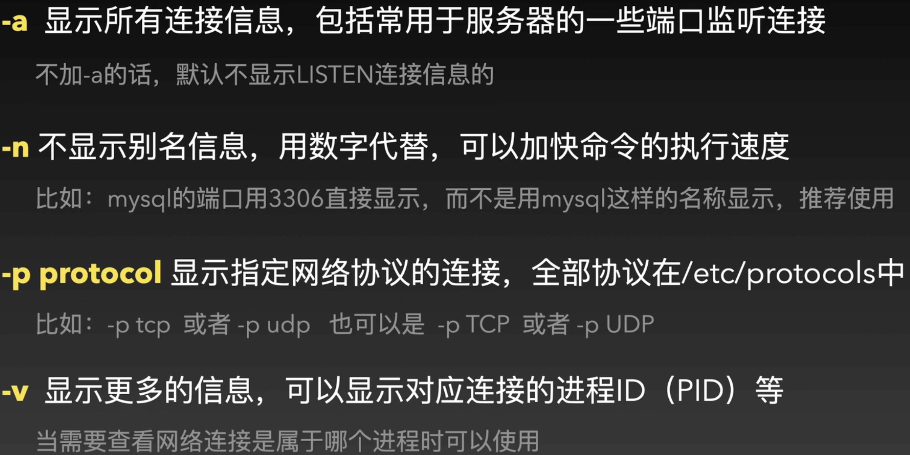
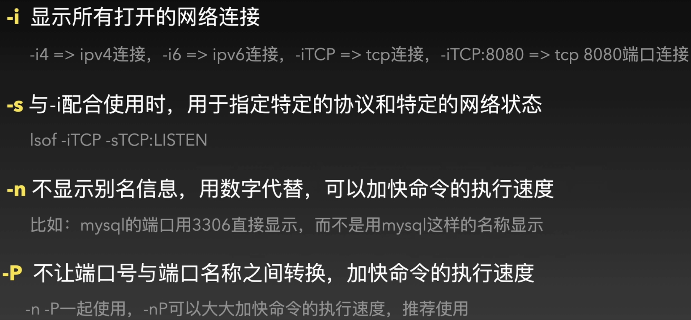
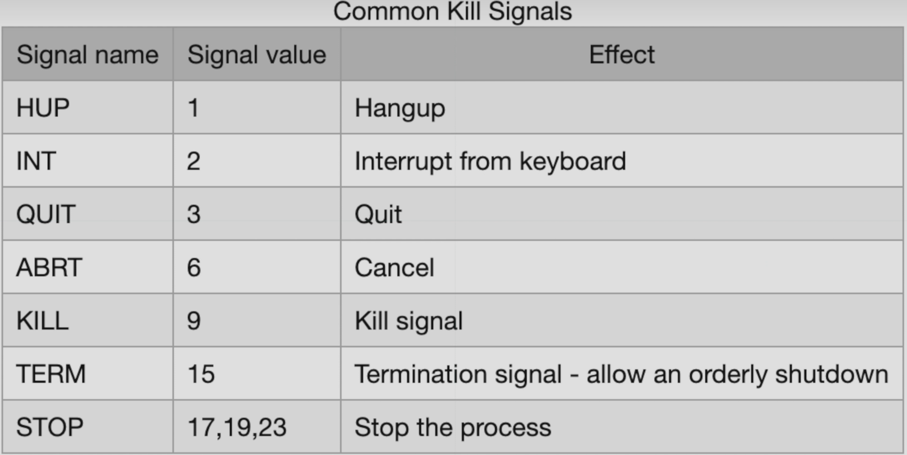

## 命令集合

#### 网络部分

##### ping

> 检查网络连通性

* ping 域名 或者 ping ip

```shell
ping www.baidu.com
ping 192.168.0.1
```

##### ifconfig

> 查看|配置网络接口(网卡)信息

```shell
ifconfig
```


* 查看指定网卡信息

ifconfig interface-name

```shell
ifconfig en0
```

##### networksetup

> 查看网络接口简写信息

```shell
networksetup -listallhardwareports
```

##### ipconfig

> 查看|配置网络接口(网卡)信息

* 获取IP地址

ipconfig getifaddr interface-name

```shell
ipconfig getifaddr en0
```

* 获取网关地址

ipconfig getoption interface-name(option-name | option-code)

```shell
ipconfig getoption en0 router
```

* 获取DNS

ipconfig getoption interface-name(option-name | option-code) domain_name_server

```shell
ipconfig getoption en0 domain_name_server
```

##### 基于ifconfig、ipconfig配置IP信息

ifconfig interface-name inet ip-addr netmask subnet-mask

ipconfig set interface-name(MANUAL|INFORM)ip-address subnet-mask

##### netstat

> 查看网络连接、端口、协议等





查看pid 进程ID对应的程序名称

```shell
ps -p pid
```

-r 显示网络路由表信息

> 查看网络数据包是如何一步一步路由出去的

-L 显示出监听队列的信息

> 查看监听队列的大小信息，需要与-a 一起使用，-aL

-I 显示出完整的IPv6的地址信息

> 注意该参数在windows 和 linux上的使用区别，Mac 下不建议使用

常用命令如下：

```shell
netstat -a
netstat -an
netstat -anv
netstat -anvp tcp
netstat -anvp udp
netstat -r
netstat -aL
netstat -anL
netstat -al
netstat -anl
```

##### ISof

> 查看系统打开文件信息，比 netstat 更加友好



常用命令如下：

```shell
lsof -i
lsof -iTCP
lsof -iTCP:8080
lsof -iTCP:8080 -nP

lsof -iTCP -sTCP:LISTEN
lsof -iTCP -sTCP:LISTEN -nP
lsof -iTCP:3306 -sTCP:LISTEN -nP

配合sudo使用可以查看所有用户打开的网络连接，比如：sudo lsof -i
不加sudo,默认只能查看当前用户打开的网络连接
```

##### 查看监听状态的端口

方法一：

```shell
netstat -an|grep LISTEN
netstat -anv|grep -i listen
```

方法二：

```shell
lsof -iTCP -sTCP:LISTEN -nP
sudo lsof -iTCP -sTCP:LISTEN -nP
```

##### 查看指定端口占用情况

方法一：

```shell
netstat -an|grep 3306
netstat -anv|grep 3306
```

方法二：

```shell
lsof -i:3306 -nP 可以配合sudo查看所有用户打开的连接
lsof -iTCP:3306 -sTCP:LISTEN -nP
```

##### traceroute

> 查看路由追踪信息

traceroute 域名 或者 traceroute IP地址

例如：

```shell
traceroute www.baidu.com
traceroute 192.168.0.1
```

#### 进程相关

##### PS

> 查看系统进程信息(瞬时状态)

```shell
ps -A 显示所有进程信息
ps -e | less 显示所有进程信息,并设置less：分屏显示
ps -ef | less 显示所有进程信息,以及更多列信息,并设置less：分屏显示
ps -a 显示在终端中正在运行的进程信息
ps -ax 显示所有进程信息
ps -p 进程ID 显示当前指定进程信息
ps -u username 显示指定用户的进程信息（username = root...）
ps -U userID 显示指定用户的进程信息（userID = 0...）
```

```shell
ps -o keyword 指定输出列项
ps -A -o user -o pid -o comm
ps -L 显示所有支持的keyword
```

##### id

> 查看用户信息

id -nu userID
显示userID对应的用户昵称

```shell
id -nu 501
```

##### kill

> 结束掉一个进程

kill -9 pid

结束指定的pid进程，如果杀掉的是其他用户的进程，需要添加sudo来提高权限



Killall name

结束掉一个名称name的进程，支持批量操作

```shell
Killall -9 name
```

pkill -9 进程名(部分名称)，支持批量操作

结束掉一个进程 

##### top

> 查看动态进程信息

##### powermetrics

> 获取电脑运行温度、风扇转速、硬盘读写速度等各种传感器信息

sudo powermetrics

```shell
sudo powermetrics -s 传感器(smc)
指定获取某个传感器的信息
```

```shell
powermetrics -h
显示支持的所有传感器
```

```shell
sudo powermetrics -n 1
命令只执行一次，默认会不断采样输出显示
```

#### shutdown

shutdown [-h(halt)|-s(sleep)|-r(reboot)] time [提示信息]

time 支持4种形式

* now
* 分钟数
* hh:mm 今天的几时几分
* yymmddhhmm 指定年份、月份、日期、小时、分钟

shutdown -r now 等价于 reboot  

shutdown -h now 等价于 halt
