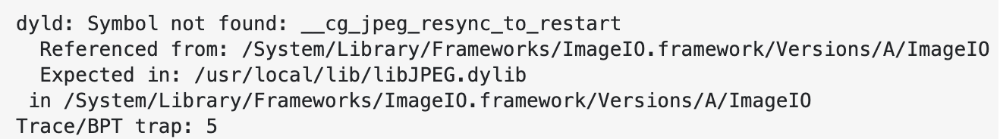

## 具体配置

#### 总结

* `# message()`可以用来打印
* `# $${}`可以用来取值：.pro中定义的变量
* `# $${}`可以用来取值：系统环境变量中的值
* 在首次基于QTCreator运行时，可能会出现如下error



此时可以执行如下命令来解决

```qt
$ cd /System/Library/Frameworks/ImageIO.framework/Versions/A/Resources

$ sudo ln -sf libJPEG.dylib /usr/local/lib/libJPEG.dylib

$ sudo ln -sf libPng.dylib /usr/local/lib/libPng.dylib

$ sudo ln -sf libTIFF.dylib /usr/local/lib/libTIFF.dylib

$ sudo ln -sf libGIF.dylib /usr/local/lib/libGIF.dylib
```

